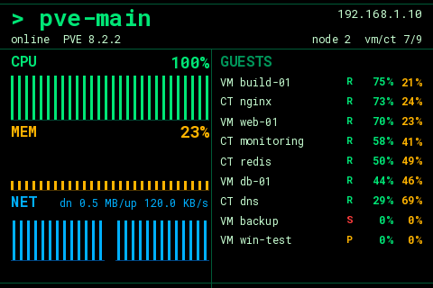
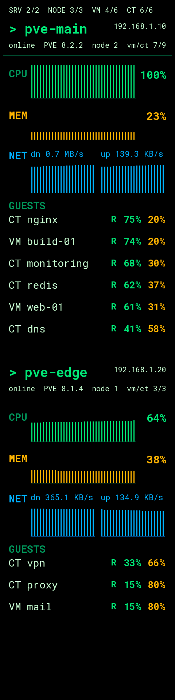
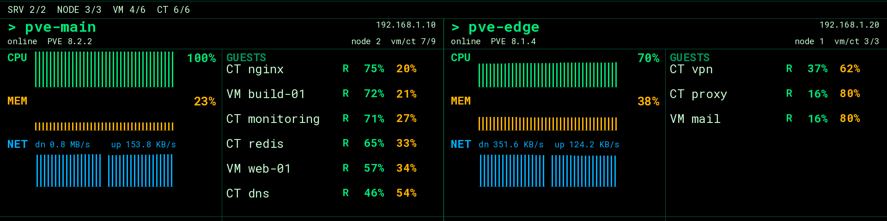

# proxmox-status-screen

A small CLI daemon that monitors one or more **Proxmox VE** servers and renders
nodes, VMs and containers on a Turing-compatible USB display.

It reuses the hardware driver and the Pillow drawing primitives of
[turing-smart-screen-python](https://github.com/mathoudebine/turing-smart-screen-python),
but replaces the sensor collection, theming and application logic with a
Proxmox-oriented implementation. There is no desktop UI: it runs in the
foreground and is meant to be supervised by systemd.

`proxmox-default` (3.5" landscape):



`proxmox-turzx-8inch-vertical` (8.8" portrait):



`proxmox-turzx-8inch-horizontal` (8.8" landscape):



## Features

- Multiple Proxmox servers, each with multiple nodes and guests (VMs + containers)
- Proxmox REST API with API-token authentication
- Concurrent polling with per-server timeout, backoff and last-known-state fallback
- Persistent HTTP sessions and a cached PVE version to keep API load low
- YAML theme with data bindings (`{summary.vms_running}`, `{guest.cpu_percent:.0f}%`, ...)
- Repeating guest/node list widget with automatic page rotation
- Text, progress bar, radial gauge, line graph, histogram and image widgets (Pillow)
- Uniform, evenly spaced histogram bars
- Simulated display (`screencap.png` + live browser preview) for development without hardware
- Built-in `stub` data source: full dashboard without any Proxmox server

### Efficiency

The daemon is designed to keep CPU usage low on always-on, low-power hosts:

- The refresh interval is configurable from 5 s to 1 h (`render.interval`, or
  `--interval` on the command line).
- Unchanged widgets are not redrawn: each widget's resolved inputs are hashed and
  a frame is skipped when nothing changed (history-based graphs always redraw).
- Background images are decoded once and cached instead of being re-read every
  frame.
- The display write worker blocks on its queue instead of polling, so an idle
  daemon does no periodic work.

## Requirements

- Python 3.9 – 3.14
- `pip install -r requirements.txt`
- For development/tests: `pip install -r requirements-dev.txt`

Only `requests`, `PyYAML`, `Pillow`, `pyserial` and `numpy` are needed for the
simulated display. `pyusb` / `pycryptodome` are only required for the `TUR_USB`
display revision.

## Installation

```bash
git clone <your-repository-url> proxmox-status-screen
cd proxmox-status-screen
pip install -r requirements.txt
```

## Quick start (no hardware, no Proxmox)

Create a local configuration that uses the simulated display and the built-in
stub data source:

```bash
cp config.example.yaml config.yaml
```

Then set these values in `config.yaml`:

```yaml
theme: proxmox-turzx-8inch-vertical
display:
  revision: SIMU
data:
  source: stub
```

```bash
python main.py once      # render one frame -> screencap.png
python main.py run       # continuous loop, preview at http://localhost:5680
```

## Proxmox setup

The monitor authenticates with a **read-only API token**. The commands below are
run as `root` on any node of the cluster (or use the equivalent screens in the
Proxmox web UI: **Datacenter → Permissions**).

### 1. Create a dedicated user

```bash
pveum user add monitor@pve --comment "proxmox-status-screen display"
```

No password is required: token authentication does not use one.

### 2. Grant read-only permissions

```bash
pveum acl modify / --users monitor@pve --roles PVEAuditor
```

`PVEAuditor` is read-only and sufficient for this monitor. To be more strict,
create a custom role containing `Sys.Audit`, `VM.Audit` and `Datastore.Audit`
and assign that instead.

### 3. Create an API token

```bash
pveum user token add monitor@pve turing --privsep 0
```

- `--privsep 0` makes the token inherit the user's permissions. With the default
  `--privsep 1` the token would have no privileges of its own.
- The command prints the token secret **only once** — copy it now.

You will end up with:

| Value | Example |
|---|---|
| Token ID | `monitor@pve!turing` |
| Token secret | `xxxxxxxx-xxxx-xxxx-xxxx-xxxxxxxxxxxx` |

### 4. Put the token in `config.yaml`

Copy the example configuration and edit it:

```bash
cp config.example.yaml config.yaml
```

```yaml
servers:
  - name: pve-main
    host: 192.168.1.10
    port: 8006
    token_id: monitor@pve!turing
    token_secret: ${PVE_TOKEN}   # read from the environment
    verify_ssl: false            # Proxmox uses a self-signed certificate by default
    timeout: 5
    nodes: []                    # empty = all nodes; otherwise e.g. [pve1, pve2]
```

Any string value in `config.yaml` supports `${VAR}` environment-variable
expansion. **Using an environment variable for `token_secret` is the recommended
way to keep the secret out of the file:**

```bash
export PVE_TOKEN=xxxxxxxx-xxxx-xxxx-xxxx-xxxxxxxxxxxx
```

When running under systemd, put the variable in an `EnvironmentFile` (see
[systemd](#systemd) below) instead of exporting it in a shell.

### 5. Verify

```bash
python main.py check
```

This validates the configuration and tests connectivity to every configured
server without drawing anything.

## Configuration

`config.yaml` is the single configuration file. See `config.example.yaml` for a
fully documented example. The main sections are:

| Section | Purpose |
|---|---|
| `theme` | Folder name under `themes/` |
| `display` | Hardware revision, COM port, brightness, orientation, SIMU options |
| `render` | `interval` (seconds between API poll + redraw, 5–3600) and `page_interval` (seconds between guest-list pages) |
| `data.source` | `proxmox` or `stub` |
| `servers` | List of Proxmox endpoints (host, port, token, TLS) |

### Display revisions

Set `display.revision` to match your hardware:

| Revision | Display |
|---|---|
| `A` | Turing 3.5" / UsbPCMonitor 3.5"/5" |
| `B` | XuanFang 3.5" (incl. flagship) |
| `C` | Turing 2.1"/2.8"/5"/8.8" |
| `D` | Kipye Qiye Smart Display 3.5" |
| `TUR_USB` | Turing HW rev 1.x: 4.6"/5.2"/8"/8.8"/9.2" |
| `WEACT_A` | WeAct Studio FS V1 3.5" |
| `WEACT_B` | WeAct Studio FS V1 0.96" |
| `SIMU` | Simulated display: writes `screencap.png` (no hardware needed) |

## Running

```bash
python main.py run     # foreground daemon loop
python main.py once    # render a single frame and exit
python main.py check   # validate config + test connectivity to every server
```

All commands accept `--config PATH`, `--log-file PATH` and `--log-level LEVEL`.
`run` and `once` also accept `--interval SECONDS` (`-i`) to override
`render.interval`; the value must be between 5 seconds and 1 hour.

### systemd

Install the sample unit from `systemd/proxmox-status-screen.service`, adjust the paths
and user, then:

```bash
sudo systemctl daemon-reload
sudo systemctl enable --now proxmox-status-screen
journalctl -u proxmox-status-screen -f
```

To keep the token out of `config.yaml`, create an environment file and uncomment
the matching line in the unit:

```bash
# /etc/proxmox-status-screen/env
PVE_TOKEN=xxxxxxxx-xxxx-xxxx-xxxx-xxxxxxxxxxxx
```

```
# in systemd/proxmox-status-screen.service
EnvironmentFile=-/etc/proxmox-status-screen/env
```

## Theming

A theme lives in `themes/<name>/` and contains a `theme.yaml` plus its assets.
Three themes are bundled: `proxmox-default` (3.5" landscape, single server panel
in the vertical/TUI style), `proxmox-turzx-8inch-vertical` (8.8" portrait, two
stacked server panels) and `proxmox-turzx-8inch-horizontal` (8.8" landscape, two
side-by-side server panels).

### Data context

Bindings use Python format-string syntax and are resolved against:

| Key | Description |
|---|---|
| `time`, `date` | Current `datetime` |
| `summary` | Aggregates: `vms_running`, `vms_total`, `cts_running`, `mem_percent`, `cpu_percent`, ... |
| `servers`, `server[name]` | Servers (list and lookup by name) |
| `nodes`, `node[name]` | All nodes |
| `guests` | All VMs and containers |
| `item` / `guest` / `node` | Current row inside a `list` widget |

Examples:

```yaml
value: "{time:%H:%M:%S}"
value: "VM {summary.vms_running}/{summary.vms_total}"
value: "{server[pve-main].status}"
value: "{servers[0].host}"          # configured server address (IP/hostname)
value: "{item.cpu_percent:>3.0f}%"
```

### Widgets

- `text` – `value`, `x`, `y`, `width`, `font`, `font_size`, `font_color`, `align`, `anchor`
- `progress` – `value`, `x`, `y`, `width`, `height`, `min_value`, `max_value`, `bar_color`
- `radial` – `value`, `x`/`y` (center), `radius`, `width`, `text`, `bar_color`, angles...
- `line_graph` – `value`, `history`, `min_value`, `max_value`, `autoscale`, `line_color`, `axis`
- `histogram` – `value`, `history`, `min_value`/`max_value` or `autoscale`, `bar_color`,
  `bar_width` (fixed integer bar width, default 3), `bar_gap` (pixels, default 2),
  `axis`, `axis_color`. Bars are uniform; only the most recent samples that fit are shown.
- `image` – `path`, `x`, `y`, `width`, `height`
- `list` – `source` (`guests`/`nodes`/`servers`) **or** `server` (index/name, gathers
  that server's guests), `rows`, `row_height`, `page_interval`, `sort_by`, `sort_reverse`,
  `filter_status`, `exclude_templates`, and `fields` (each a `text` widget with
  relative `x`/`y`). A field can also set `color_value` + `color_map` to color each
  row based on a binding (e.g. green `R` for running, red `S` for stopped).

Set `background_image: background.png` (or omit it) to draw over the theme
background; specify `background_color` instead for a solid background. Omit
`background_image` and `background_color` to inherit the theme background.

## Development

```bash
pip install -r requirements-dev.txt
python main.py once                 # simulated render -> screencap.png
pytest                              # unit tests
```

Set `display.simu_webserver: true` and open <http://localhost:5680> to watch the
simulated screen live.

If you want to contribute a theme or a feature, see [`AGENTS.md`](AGENTS.md) for
an architecture overview, the theme/widget authoring guide and the project
conventions. It is written to be equally useful to humans and AI coding agents.

## Project layout

```
main.py                      CLI entry point
proxmox_status_screen/       application code (config, client, models, renderer, ...)
display_driver/              vendored LCD driver from turing-smart-screen-python
fonts/                       bundled font subset
themes/                      themes
tests/                       unit tests
systemd/                     sample systemd unit
docs/                        README assets
```

## License

GPL-3.0-or-later. See `LICENSE`.

`proxmox-status-screen` vendors the display driver of
[turing-smart-screen-python](https://github.com/mathoudebine/turing-smart-screen-python),
which is why the project is distributed under the same license.

## Credits

This project would not exist without
[turing-smart-screen-python](https://github.com/mathoudebine/turing-smart-screen-python)
by **Matthieu Houdebine (@mathoudebine)** and its many contributors — the
vendored display driver and drawing primitives come from there.

See [`CREDITS.md`](CREDITS.md) for the full list of turing-smart-screen-python
authors and contributors, font licenses and third-party dependencies.
